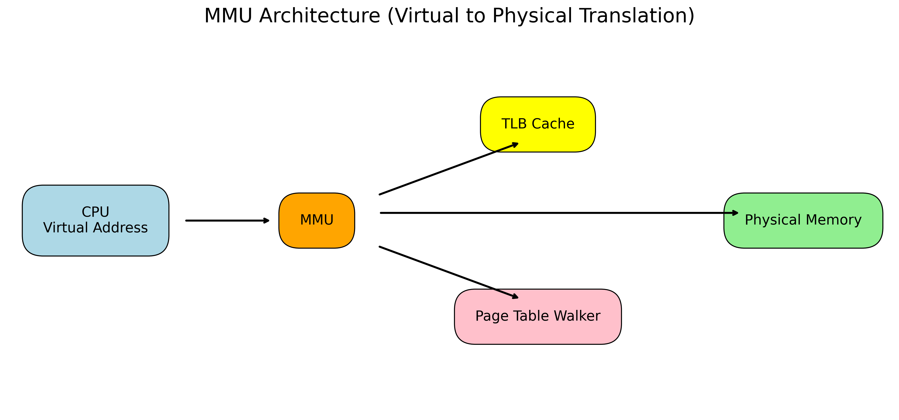
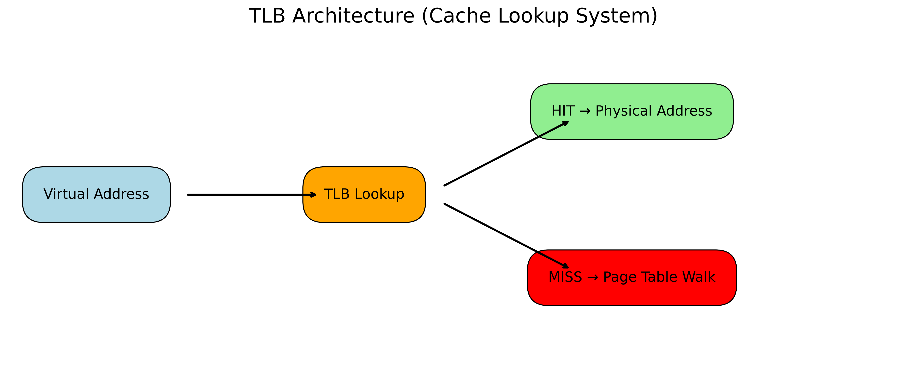
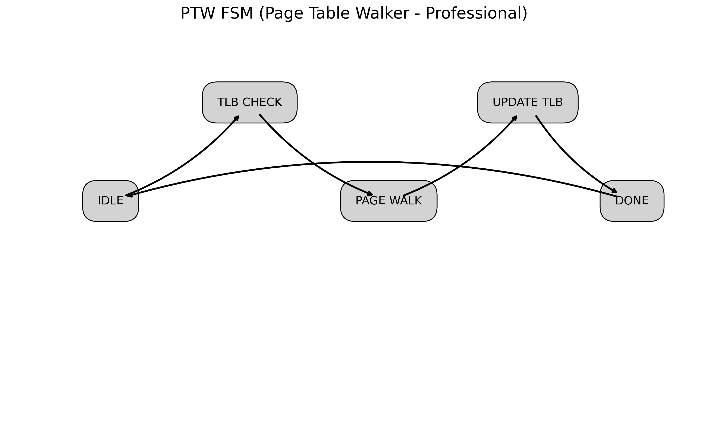
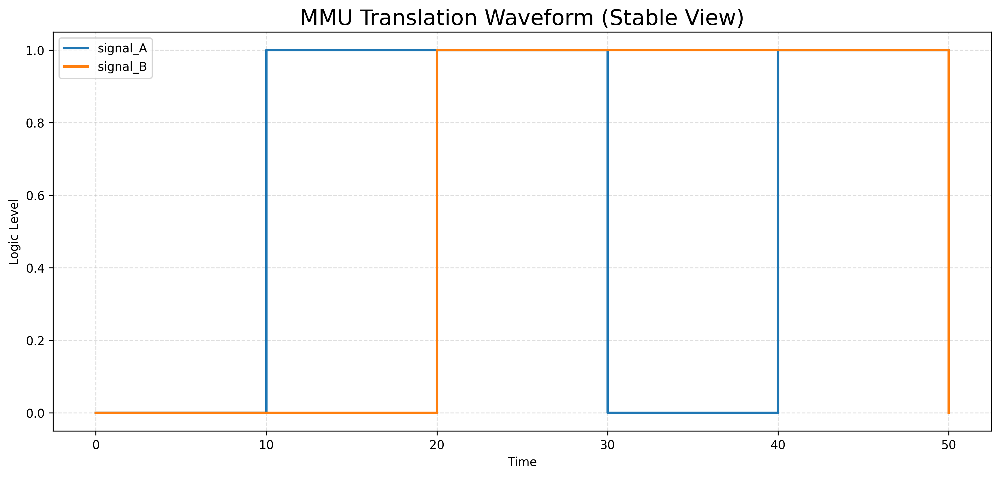

# 🧠 Memory Management Unit (MMU) Design using Verilog HDL

## 📌 Overview
This project implements a **Memory Management Unit (MMU)** in Verilog HDL, including key components such as:

- Translation Lookaside Buffer (TLB)
- Page Table Walker (PTW)
- Virtual to Physical Address Translation flow
- FSM-based control logic
- Simulation and waveform analysis

Additionally, Python scripts are used to generate **professional architecture diagrams and waveform visualizations**.

---

## 🚀 Features

- 🔹 Verilog-based RTL design of MMU system
- 🔹 TLB for fast address translation
- 🔹 Page Table Walker (PTW) for miss handling
- 🔹 FSM-based control flow design
- 🔹 Complete testbench simulation
- 🔹 VCD waveform generation using Icarus Verilog
- 🔹 Python-based diagram generation for architecture visualization

---

## 🏗️ System Architecture

### 🧩 MMU Architecture

### 🧩 TLB Architecture

### 🧩 Page Table Walker FSM

---

## 📊 Simulation Waveform

### 🔬 Translation Waveform

This waveform represents:
- Virtual address translation flow
- Hit/Miss behavior in TLB
- Page table access behavior

---

## 🧠 Workflow
CPU generates Virtual Address
↓
MMU
↓
TLB Lookup
↓ ↓
HIT MISS
↓ ↓
Physical Page Table Walk
Address ↓
Update TLB
↓
Physical Address Output

---

## 🛠️ Tech Stack

- **Verilog HDL** (RTL Design)
- **Icarus Verilog** (Simulation)
- **GTKWave** (Waveform Viewer)
- **Python (Matplotlib, VCDVCD)** (Diagram Generation)

---

## 📂 Project Structure

MMU-Design-Verilog-HDL/
│
├── rtl/ # Verilog design files
├── tb/ # Testbench files
├── images/ # Generated architecture diagrams
├── generate_all_images.py # Python script for image generation
├── mmu.vcd # Simulation dump file (ignored in git)
├── mmu_sim # Simulation executable (ignored)
├── README.md
├── LICENSE
├── .gitignore

---

## ⚙️ How to Run

### 1. Compile Verilog
iverilog -o mmu_sim tb/top_tb.v rtl/*.v

### 2. Run Simulation
vvp mmu_sim

### 3. View Waveform
gtkwave mmu.vcd

### 4. Generate Architecture Images
python generate_all_images.py

---

## 📈 Learning Outcomes

- Understanding of virtual memory systems  
- Implementation of MMU architecture  
- Design of FSM-based hardware logic  
- Hands-on experience with RTL simulation flow  
- Visualization of hardware using Python tools  

---

## 👨‍💻 Author

Ananya Jain  

---

## 📜 License

This project is licensed under the MIT License - see the LICENSE file for details.
